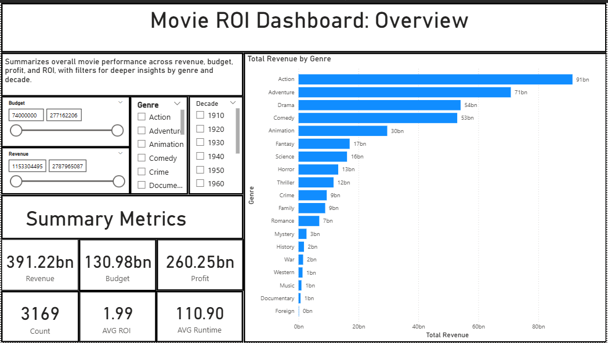
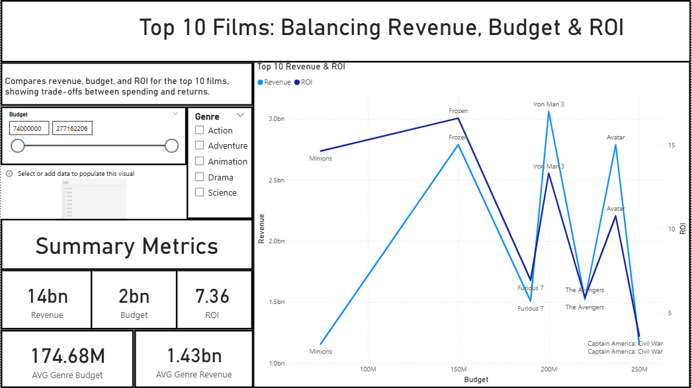
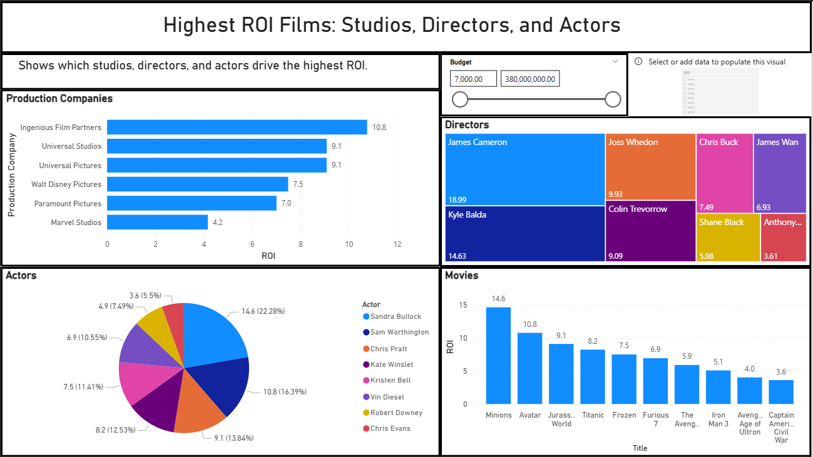
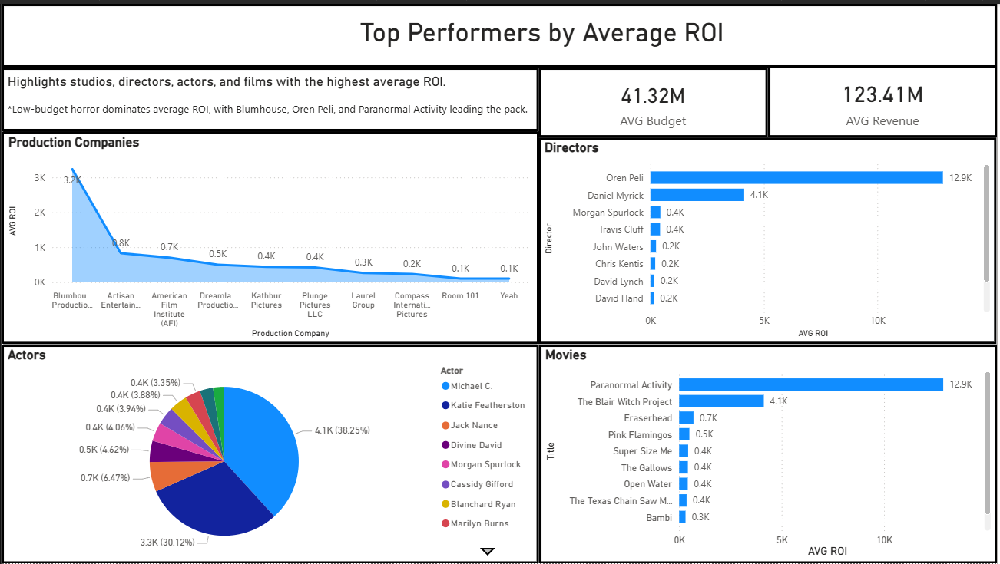
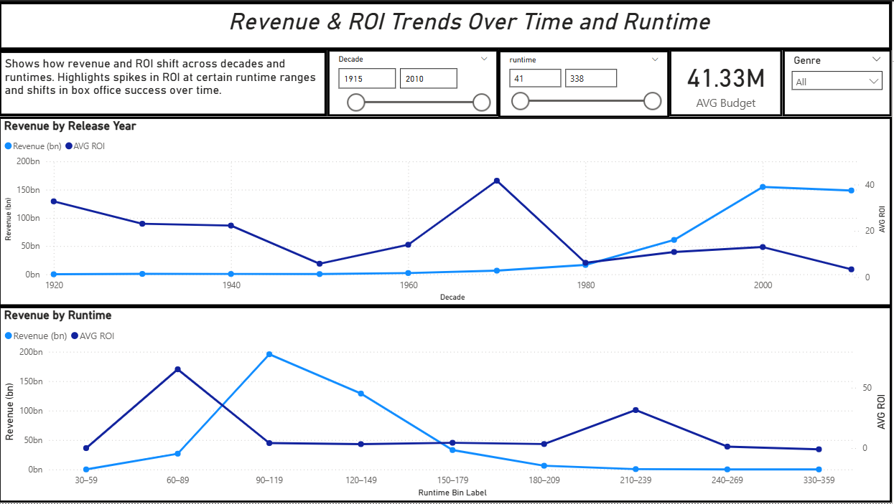
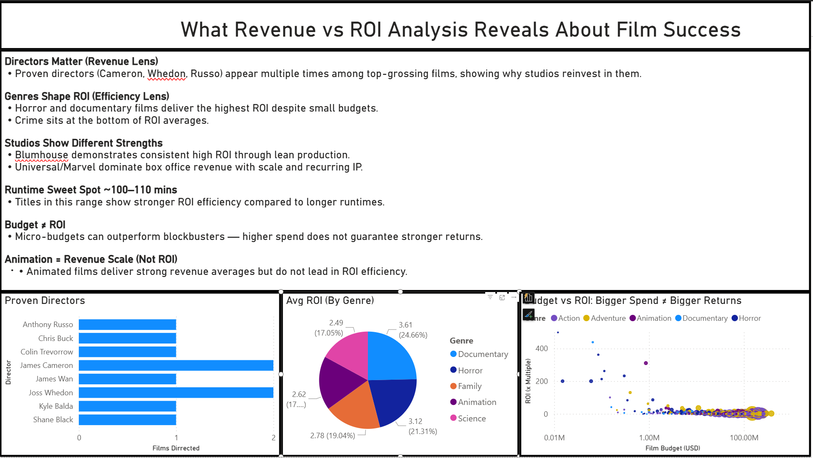

# How to Read this Repo
- **Start here:** Scroll to the [Dashboard Preview](#dashboard-preview) to see the Power BI visuals.  
- **SQL logic:** All queries are in the [sql-queries/](sql-queries) folder.  
- **Dashboard file:** [Download movie_roi_dashboard_update.pbix](dashboard/movie_roi_dashboard_update.pbix)   open in Power BI Desktop for full interactivity.  
- **Quick skim:** - [README.md](README.md) – walks through objectives, queries, and insights step by step.  
  
# 🎬 Movie Industry ROI Analysis

## Using SQL, Excel, and Power BI to Uncover What Drives Film ROI

This project analyzes a curated sample of the **top 10 ROI-performing films** drawn from a cleaned dataset of **600+ titles (1997–2016)**. The aim is to simulate how a customer-insights / business analyst would respond to an executive ask: *“What traits consistently show up in our biggest wins?”*

**Objective:** identify repeatable signals—**genre, director, budget, runtime, production company**—that correlate with outsized ROI and can inform smarter green-light decisions.

**Tools & approach**
- **SQL:** data cleaning, joins, views to shape analysis tables  
- **Excel:** validation checks, calculated fields, quick sanity tests  
- **Power BI:** data model, DAX measures, interactive visuals & slicers

**Dashboard pages**
- **Overview:** ROI performance at a glance (films, directors, actors, studios)
- **Detailed ROI:** top performers with drill-downs
- **Trends Over Time:** ROI & revenue patterns by release year and runtime
- **Genre Analysis:** category-level ROI comparisons
- **Findings:** concise recommendations supported by the data
- **Behind the Dashboard:** build notes and assumptions

**Outcome (high level):** low-budget categories—especially **horror/documentary**—frequently outperform on ROI; select studios and directors recur among top performers, suggesting targeted bets can amplify returns.

---

## Table of Contents

- [Dashboard Preview](#dashboard-preview)
- [Business Objective](#business-objective)
- [Key Insights From the Analysis](#key-insights-from-the-analysis)
- [Data Source](#data-source)
- [Data Preparation and Cleaning](#data-preparation-and-cleaning)
- [SQL Queries](#sql-queries)
- [Real World Role Alignment](#real-world-role-alignment)
- [Folder Structure](#folder-structure)
- [Project Progress and Next Steps](#project-progress-and-next-steps)
- [Contact](#contact)
- [Disclaimer](#disclaimer)

---

## Dashboard Preview

This dashboard analyzes ROI trends across 600+ films released between 1997–2016. Results highlight how low-budget horror and documentary films consistently outperform big-budget productions, with Blumhouse Productions, *Paranormal Activity*, and director Oren Peli dominating ROI performance. The findings reinforce how lean production strategies often deliver the strongest financial returns.

### 🔑 Key Metrics

| **Metric**                   | **Value**                                   |
|-----------------------------|---------------------------------------------|
| **ROI Formula**             | (Revenue – Budget) / Budget                 |
| **# of Titles Analyzed**    | ~600 films (cleaned dataset)                |
| **Time Window**             | 1997–2016 releases                          |
| **Top ROI Genre**           | Horror (~3.1 ROI)                           |
| **Lowest ROI Genre**        | Crime (~1.4 ROI)                            |
| **Top Production Company**  | Blumhouse Productions (3.2K+ ROI)           |
| **Top Director**            | Oren Peli (12.9K ROI – *Paranormal Activity*) |
| **Top Actor (Avg ROI)**     | Michael C. (4.1K ROI – *Paranormal Activity*) |
| **Most Profitable Film**    | *Paranormal Activity* (12.9K ROI)           |
| **Avg ROI (All Films)**     | ~7.4                                        |
| **Avg Runtime (Top 10)**    | ~100–110 minutes                            |

1. ### Movie ROI Dashboard
  
> High-level dashboard summarizing ROI across films, directors, actors, and production companies.

2. ### Top 10 Films: Balancing Revenue, Budget & ROI  
  
> Compares the ten most profitable films by ROI, emphasizing patterns across production studios and genres.

3. ### Highest ROI Films: Studios, Directors & Actors
  
> Lists top individual films by ROI, showing how modest budgets can drive extraordinary returns.

4. ### Top Performers by Average ROI
  
> Highlights low-budget horror’s dominance, with Blumhouse, Oren Peli, and Paranormal Activity leading ROI.

5. ### Revenue & ROI by Release Year & Runtime
  
> Explores yearly ROI patterns and correlations with average film lengths.

6. ### Revenue & ROI Trends Over Time & Runtime
 
> Shows how film runtimes and release years impact ROI trends, highlighting shifts over decades.

7. ### Genre Benchmarks: Budget, Revenue & ROI
 
> Reveals ROI distribution by genre, with horror and documentary outperforming big-budget action and drama.

8. ### What Revenue vs ROI Analysis Reveals About Film Success
 
> Summarizes strategies used by top-performing films and studios to maximize ROI despite budget constraints.

9. ### Behind the Dashboard
 
> Documents project build: Power BI, Power Query, SQL, and DAX applied to simulate a real-world analytics request.

[images](/images)

---

## Business Objective

Studios invest millions into film production with no guarantee of return. This project examines a targeted subset of the **top 10 ROI performers** from a larger dataset of 600+ films (1997–2016) to answer key business questions:

- What traits define the most financially successful films?
- Are there repeatable patterns by **genre, director, runtime, or studio**?
- Do **low-budget films** reliably outperform high-budget ones?
- Which studios or production approaches consistently deliver outsized returns?

The analysis is framed as if an executive asked:  
> *“We’ve had a few huge wins — how do we find more like those?”*

The project reflects how an analyst would approach the request:  
- **Clean and prepare** raw data (SQL, Excel)  
- **Analyze and surface findings** (SQL queries, descriptive analysis)  
- **Communicate visually** with interactive dashboards (Power BI)  

**Outcome:** a multi-page dashboard highlighting repeatable traits of high-ROI films, built to simulate a real-world executive briefing.

---
## Key Insights from the Analysis

### Top Grossing Films (Revenue Leaders)
- **Proven directors dominate revenue:** James Cameron, Joss Whedon, and the Russo brothers appear multiple times among the all-time box office leaders.  
- **Franchises and recurring IP drive scale:** Marvel and Disney consistently leverage shared universes, sequels, and bankable actors to maximize global box office returns.  
- **Animation delivers high average revenue:** Pixar and Disney titles show strong monetization potential, even if they don’t top ROI charts.  

### Top ROI Films (Efficiency Leaders)
- **Micro-budgets deliver massive ROI:** *Paranormal Activity* achieved ~12,900% ROI on a ~$20K budget, far outpacing blockbuster tentpoles.  
- **Horror and documentary dominate efficiency:** Low-cost genres generated the highest ROI, while crime films consistently underperformed.  
- **Blumhouse shows a repeatable ROI model:** The studio’s lean production approach demonstrates how ROI can be engineered.  
- **Star power not required:** Unknown actors (e.g., Michael C. in *Paranormal Activity*) led top ROI films, showing concept and execution matter more than celebrity.  
- **Runtime sweet spot ~100–110 minutes:** Top ROI titles cluster around this range, suggesting concise runtimes optimize cost and engagement.  

---

## Data Source

This project uses a modified version of the publicly available movie dataset from Kaggle:
<https://www.kaggle.com/datasets/utkarshx27/movies-dataset>

The dataset includes information on genre, revenue, budget, production companies, and more.  
It has been cleaned and structured for educational and analytical purposes in this project.

---

### Data Preparation and Cleaning

- **Completed missing financials:** Filled in missing budget and revenue values using external sources (IMDb, Box Office Mojo) to ensure accurate ROI calculations.  
- **Standardized formats:** Converted release dates into a consistent year format for trend analysis.  
- **Filtered invalid records:** Removed films with zero revenue and excluded entries with invalid or missing genre labels.  
- **Normalized categorical fields:** Cleaned and standardized genre and production company names to resolve duplicates and inconsistencies (e.g., “Universal Pictures” vs. “Universal”).  
  
---

### SQL Queries

1. [Top 10 Performing Movies](sql-queries/top_movies.sql)  
   Returns the 10 highest-ROI films and their key contributors (director, studio, lead actor), forming the basis for the *Top ROI Films* analysis.  

2. [Budget to Revenue Ratio](sql-queries/budget_ratio.sql)  
   Calculates ROI for all films in the dataset using the formula `(Revenue – Budget) / Budget`, enabling dataset-wide comparisons.  

3. [Genre Summary](sql-queries/genre_summary.sql)  
   Aggregates total and average revenue, budget, and ROI by genre to highlight which categories consistently outperform or underperform.  

4. [Compare to Genre Averages](sql-queries/compare_to_avg.sql)  
   Benchmarks each film’s performance against its genre’s average ROI, surfacing outliers that dramatically over- or under-deliver.  

5. [Top Productions by Company](sql-queries/production_companies.sql)  
   Identifies studios and production companies most frequently linked to high-ROI titles (e.g., Blumhouse), demonstrating repeatable business models.  

6. [Top 10 Movies vs Average Metrics](sql-queries/avg_vs_actual.sql)  
   Compares top-performing films to dataset averages in runtime, budget, and revenue, uncovering differences that explain ROI outperformance.  

7. [Release Year + Runtime Overview](sql-queries/release_year.sql)  
   Analyzes how release year and runtime correlate with ROI, supporting insights into time-period trends and optimal film length.  

8. [Updated View for Movie Dataset](sql-queries/Updated_view_for_Movie_Data_Set.sql)  
   Consolidates cleaned budget, revenue, ROI, runtime, genre, and production company fields into a single view for use in Power BI dashboards.  

---

## Real-World Role Alignment

This project simulates the type of analysis commonly performed in roles such as:

- **Customer Experience / Voice of Customer (CX / VoC) Analysts** – spotting success patterns in customer or content outcomes and translating them into actionable strategies.  
- **Business Analysts** – supporting investment decisions with evidence from structured data (e.g., budget, ROI, performance trends).  
- **Media / Content Analysts** – analyzing creative, genre, and production data to recommend high-yield strategies for future projects.  

**Key skills demonstrated in this project:**
- **Data preparation & cleaning** – filled gaps, standardized formats, normalized categories for analysis-ready data.  
- **Exploratory SQL analysis** – uncovered top ROI performers, genre trends, and production patterns using targeted queries and a consolidated view.  
- **Insight communication** – transformed raw results into clear, scoped takeaways aligned to executive-style questions.  
- **Dashboard design (Power BI)** – built multi-page, interactive reporting with slicers, genre filters, and drill-downs.  
- **Data modeling (Power Query & DAX)** – merged multiple tables, defined ROI measures, and applied filtering logic for consistent metrics.  
---
## Folder Structure

- [sql-queries/](sql-queries) – Contains all SQL queries used to analyze the data
- [images/](images) – Contains all screenshots used in the README   
- [movie_roi_dashboard_update.pbix](dashboard/movie_roi_dashboard_update.pbix) – Power BI file for interactive exploration  
- [README.md](README.md) – Project overview, business questions, and query links

---

## Project Progress and Next Steps

**Completed to date:**
- Delivered SQL analysis through 7 structured queries plus a consolidated view for reporting.  
- Built a multi-page Power BI dashboard visualizing ROI patterns by genre, director, studio, and runtime.  
- Documented data preparation and cleaning steps to ensure analysis reliability.  

**Planned improvements:**
- Publish a LinkedIn post highlighting key findings and linking to this GitHub project to showcase professional impact.  
- Add calculated fields and measures in DAX to enhance ROI tracking, filtering logic, and scenario analysis.  
- Expand dataset to include films released through 2025 (and potentially streaming/international box office) for richer comparisons.  

---

## Contact

**Aaron Zeug**  
Customer Experience & Reporting Specialist  
Building a career in Data Analytics with a focus on clear, insight-driven storytelling.  
8+ years in CX and quality, now applying SQL, Excel, and Power BI to real-world analysis projects.  
[GitHub Profile](https://github.com/Gray135) • [LinkedIn](https://linkedin.com/in/aaronzeug)

---

## Disclaimer

This project is for educational and portfolio purposes only.  
The analysis is based on publicly available data and reflects exploratory insights only.  
It does not constitute financial, investment, or strategic business advice.  
All interpretations are illustrative and intended to demonstrate technical and analytical skills.  
Any actions taken based on this material are at the user’s own discretion.

